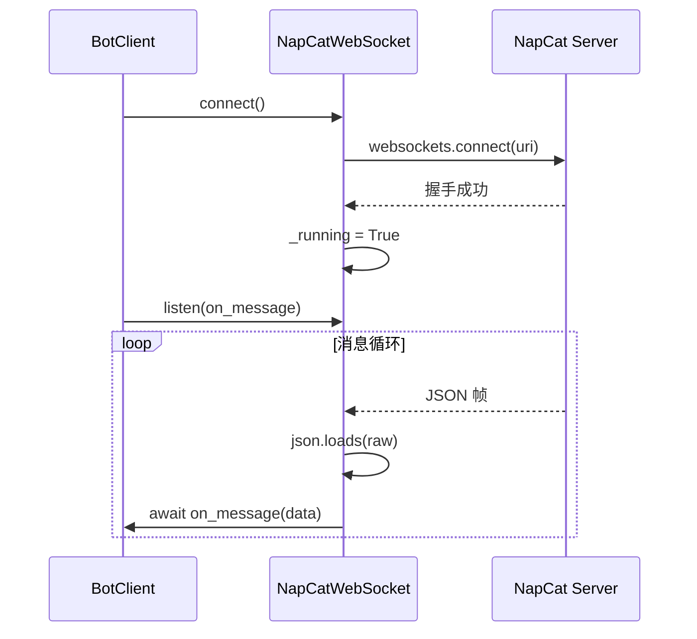
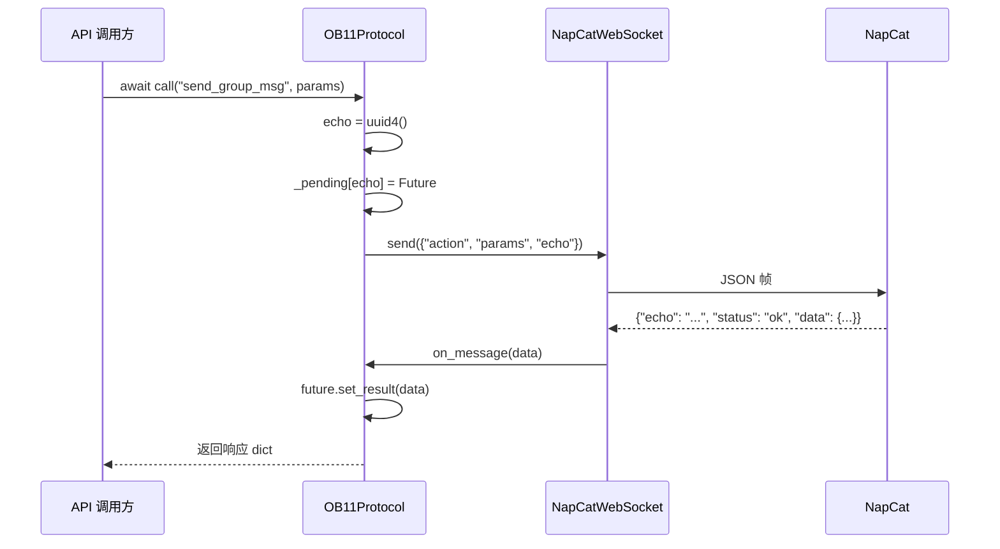

# 通信层详解

> NapCat WebSocket 连接与 OB11Protocol 请求-响应匹配的内部实现。

---

## 1. NapCat WebSocket 对接

> 源码：`ncatbot/adapter/napcat/connection/websocket.py`

`NapCatWebSocket` 是最底层的通信组件，纯粹负责 WebSocket 连接建立、数据收发和断线重连，不包含任何业务逻辑。

### 1.1 连接建立流程



连接参数：

```python
# websocket.py — connect()
self._client = await websockets.connect(
    self._uri, close_timeout=0.2, max_size=2**30, open_timeout=5,
)
```

| 参数 | 值 | 说明 |
|------|-----|------|
| `close_timeout` | 0.2s | 关闭握手超时（快速断开） |
| `max_size` | 2³⁰ (~1GB) | 最大帧大小（支持大文件传输） |
| `open_timeout` | 5s | 连接建立超时 |

**发送锁**：`NapCatWebSocket` 使用 `asyncio.Lock` 保护 `send()` 方法，防止并发写入导致帧交错：

```python
# websocket.py — send()
async def send(self, data: dict) -> None:
    async with self._send_lock:
        if not self._client:
            raise ConnectionError("WebSocket 未连接")
        await self._client.send(json.dumps(data))
```

### 1.2 消息帧格式

NapCat 使用 OneBot v11 正向 WebSocket 协议，所有消息均为 JSON 文本帧。框架中上下行帧统一处理为 `dict`：

**下行（Server → Bot）**：

| 类型 | 特征 | 处理方式 |
|------|------|----------|
| API 响应 | 包含 `echo` 字段 | OB11Protocol 匹配 Future |
| 事件推送 | 不含 `echo`，含 `post_type` | 转发给 event_handler |

**上行（Bot → Server）**：

```json
{
    "action": "send_group_msg",
    "params": {"group_id": 123456, "message": [...]},
    "echo": "550e8400-e29b-41d4-a716-446655440000"
}
```

### 1.3 心跳与自动重连

NapCat 服务端定期推送 `meta_event.heartbeat` 事件，框架不主动发送心跳——依赖 NapCat 的心跳推送来判断连接存活。

当 WebSocket 连接断开时，`listen()` 方法内部捕获 `ConnectionClosedError` 并触发指数退避重连：

```python
# websocket.py — _reconnect()
async def _reconnect(self) -> bool:
    delay = _RECONNECT_BASE_DELAY  # 1.0 秒
    for attempt in range(1, _MAX_RECONNECT_ATTEMPTS + 1):  # 最多 5 次
        try:
            self._client = await websockets.connect(
                self._uri, close_timeout=0.2, max_size=2**30, open_timeout=5,
            )
            return True
        except Exception as e:
            if attempt < _MAX_RECONNECT_ATTEMPTS:
                await asyncio.sleep(delay)
                delay = min(delay * 2, _RECONNECT_MAX_DELAY)  # 上限 30 秒
    return False
```

重连参数：

| 常量 | 值 | 说明 |
|------|-----|------|
| `_MAX_RECONNECT_ATTEMPTS` | 5 | 最大重连次数 |
| `_RECONNECT_BASE_DELAY` | 1.0s | 初始退避延迟 |
| `_RECONNECT_MAX_DELAY` | 30.0s | 最大退避延迟 |

重连失败时，`listen()` 抛出 `ConnectionError("WebSocket 重连失败")`，由上层 Adapter 决定后续行为。

---

## 2. OB11Protocol 序列号匹配

> 源码：`ncatbot/adapter/napcat/connection/protocol.py`

`OB11Protocol` 是请求-响应匹配层，使用 UUID echo 字段 + `asyncio.Future` 实现异步 API 调用的请求-响应配对。



### 2.1 请求发送

`call()` 方法在发送前分配 UUID echo 并注册 Future：

```python
# protocol.py — call()
async def call(self, action: str, params: Optional[dict] = None,
               timeout: float = 30.0) -> dict:
    echo = str(uuid.uuid4())
    loop = asyncio.get_running_loop()
    future: asyncio.Future = loop.create_future()
    self._pending[echo] = future

    try:
        await self._ws.send({
            "action": action.replace("/", ""),
            "params": params or {},
            "echo": echo,
        })
        return await asyncio.wait_for(future, timeout=timeout)
    except asyncio.TimeoutError:
        raise TimeoutError(f"API 请求超时: {action}")
    finally:
        self._pending.pop(echo, None)
```

关键实现细节：

1. **`action.replace("/", "")`** — 兼容部分 API 名称中包含 `/` 的情况
2. **`finally` 块保证清理** — 无论成功、超时还是异常，Future 都会从 `_pending` 中移除
3. **`loop.create_future()`** — 使用当前事件循环创建 Future，确保线程安全

### 2.2 响应接收

`on_message()` 由 `NapCatWebSocket.listen()` 在收到每帧数据后调用：

```python
# protocol.py — on_message()
async def on_message(self, data: dict) -> None:
    echo = data.get("echo")

    if echo:
        future = self._pending.get(echo)
        if future and not future.done():
            future.set_result(data)
            return

    # 非 API 响应 → 事件推送
    if self._event_handler:
        await self._event_handler(data)
```

分类逻辑：

| 条件 | 处理 |
|------|------|
| `echo` 存在且 Future 未完成 | `future.set_result(data)` → 唤醒调用方 |
| `echo` 存在但无匹配 Future | 视为过期响应，转入事件处理 |
| `echo` 不存在 | 事件推送，调用 `_event_handler` |

### 2.3 超时处理

超时通过 `asyncio.wait_for(future, timeout)` 实现，默认 30 秒。超时后：

1. `wait_for` 取消 Future 并抛出 `asyncio.TimeoutError`
2. 外层捕获后转换为 `TimeoutError(f"API 请求超时: {action}")`
3. `finally` 块从 `_pending` 中清理该 echo

**批量取消**：`cancel_all()` 用于连接关闭时清理所有挂起请求：

```python
# protocol.py — cancel_all()
def cancel_all(self) -> None:
    for future in self._pending.values():
        if not future.done():
            future.cancel()
    self._pending.clear()
```

---

*本文档基于 NcatBot 5.0.0rc7 源码编写。如源码有更新，请以实际代码为准。*
