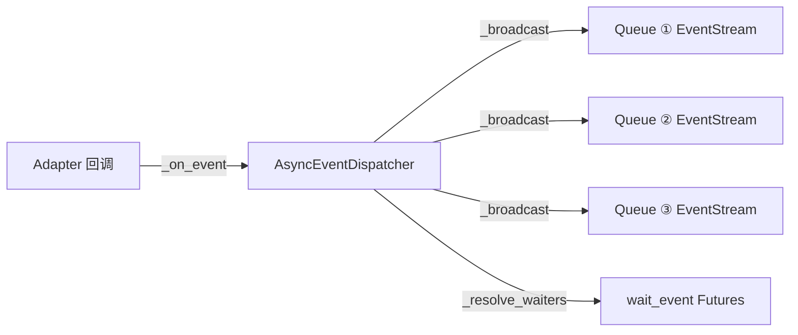
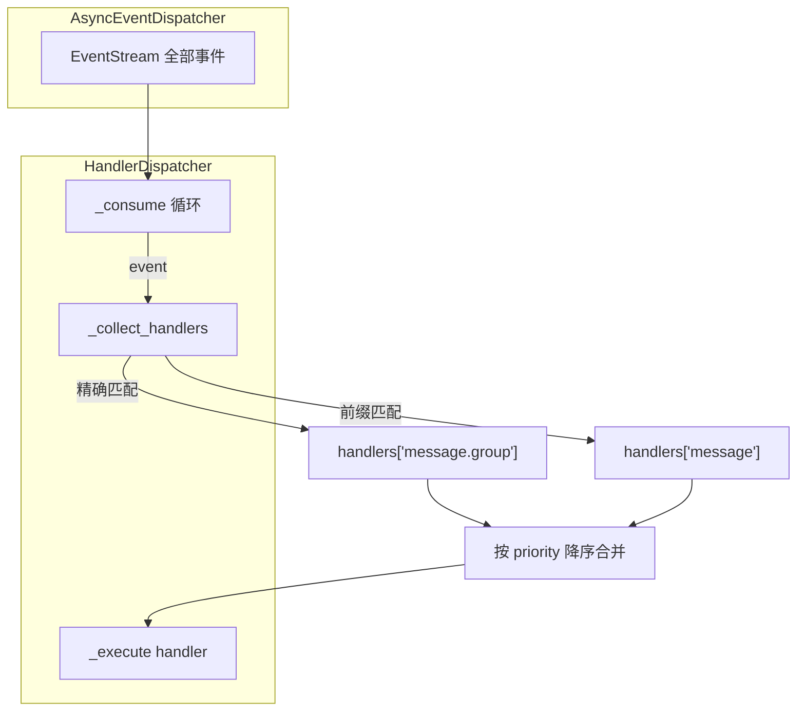
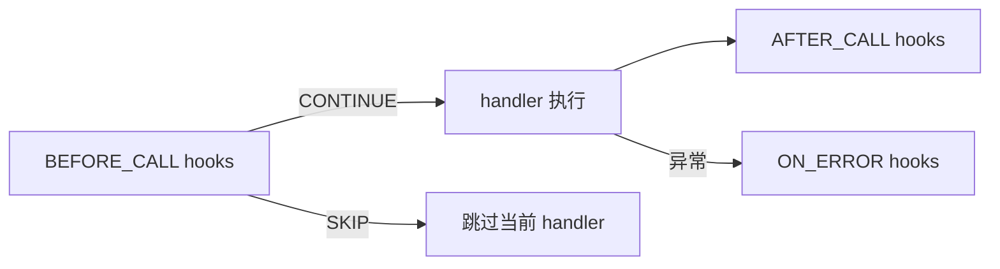

# 事件系统详解

> AsyncEventDispatcher 广播机制与 HandlerDispatcher 匹配算法的内部实现。

---

## 3. AsyncEventDispatcher 广播实现

> 源码：`ncatbot/core/dispatcher/dispatcher.py`、`ncatbot/core/dispatcher/stream.py`

`AsyncEventDispatcher` 是纯事件路由器，核心模式为 **一个生产者对多个消费者** 的广播分发。



### 3.1 asyncio.Queue 多消费者分发

每当调用 `events()` 创建一个 `EventStream`，就在 dispatcher 内部注册一个 `asyncio.Queue`：

```python
# dispatcher.py — events()
def events(self, event_type=None) -> EventStream:
    queue: asyncio.Queue = asyncio.Queue(maxsize=self._stream_queue_size)
    self._stream_queues.add(queue)
    return EventStream(self, queue, event_type)
```

事件到达时，`_broadcast()` 将事件推入**所有**活跃队列：

```python
# dispatcher.py — _broadcast()
def _broadcast(self, event: Event) -> None:
    for queue in tuple(self._stream_queues):
        if queue.full():
            try:
                queue.get_nowait()  # 丢弃最旧事件
            except asyncio.QueueEmpty:
                pass
        try:
            queue.put_nowait(event)
        except Exception:
            LOG.exception("写入事件流队列失败")
```

**背压策略**：队列默认大小为 500（`_DEFAULT_STREAM_QUEUE_SIZE`）。当队列满时采用 **丢弃最旧事件** 策略——弹出队首再写入新事件，避免阻塞生产端。

**事件类型解析**：`_resolve_type()` 从 `BaseEventData` 推导出点分格式事件类型字符串：

```python
# dispatcher.py — _resolve_type() 摘要
# post_type=message, message_type=group → "message.group"
# post_type=notice, notice_type=group_increase → "notice.group_increase"
# post_type=notice, notice_type=notify, sub_type=poke → "notice.poke"
```

特殊处理：当 `notice_type == "notify"` 时，进一步解析 `sub_type`（如 `poke`、`lucky_king`），使类型路径更精确。

### 3.2 EventStream 生命周期管理

> 源码：`ncatbot/core/dispatcher/stream.py`

`EventStream` 是异步可迭代对象，持有一个 `asyncio.Queue` 引用。它支持按类型前缀过滤事件：

```python
# stream.py — __anext__()
async def __anext__(self) -> Event:
    while True:
        if self._closed:
            raise StopAsyncIteration
        item = await self._queue.get()
        if item is _STOP:
            self._closed = True
            raise StopAsyncIteration
        # 前缀过滤
        if self._prefix is not None:
            if not (item.type == self._prefix
                    or item.type.startswith(self._prefix + ".")):
                continue
        return item
```

**过滤规则**：

| `event_type` 参数 | `_prefix` 值 | 匹配行为 |
|---|---|---|
| `EventType.MESSAGE` | `"message"` | 匹配 `"message"`、`"message.group"`、`"message.private"` |
| `"message.group"` | `"message.group"` | 只匹配 `"message.group"` 及其子类型 |
| `None` | `None` | 接收全部事件 |

`_EVENT_TYPE_PREFIX` 映射表负责将 `EventType` 枚举转换为字符串前缀：

```python
_EVENT_TYPE_PREFIX = {
    EventType.MESSAGE: "message",
    EventType.MESSAGE_SENT: "message_sent",
    EventType.NOTICE: "notice",
    EventType.REQUEST: "request",
    EventType.META: "meta_event",
}
```

**哨兵值 `_STOP`**：一个 `object()` 单例，写入队列即通知 stream 终止迭代。

### 3.3 close() 清理流程

```python
# dispatcher.py — close()
async def close(self) -> None:
    if self._closed:
        return
    self._closed = True
    # 终止所有 stream：向队列写入 _STOP 哨兵
    for queue in tuple(self._stream_queues):
        try:
            queue.put_nowait(_STOP)
        except Exception:
            pass
    self._stream_queues.clear()
    # 终止所有一次性 waiter
    closed_err = RuntimeError("AsyncEventDispatcher 已关闭")
    for waiter in self._waiters:
        if not waiter.future.done():
            waiter.future.set_exception(closed_err)
    self._waiters.clear()
```

清理顺序：

1. **标记 `_closed = True`** — 阻止新的 `events()` 和 `wait_event()` 调用
2. **向所有队列写入 `_STOP`** — 唤醒阻塞在 `queue.get()` 上的 EventStream
3. **清空 `_stream_queues`** — 释放队列集合
4. **对所有 waiter 设置异常** — 唤醒阻塞在 `wait_event()` 上的调用方
5. **清空 `_waiters`** — 释放 waiter 列表

`EventStream.aclose()` 则负责从 dispatcher 注销自己的队列：

```python
# stream.py — aclose()
async def aclose(self) -> None:
    if self._closed:
        return
    self._closed = True
    self._dispatcher._unregister_stream(self._queue)
```

---

## 4. HandlerDispatcher 匹配算法

> 源码：`ncatbot/core/registry/dispatcher.py`

`HandlerDispatcher` 订阅 `AsyncEventDispatcher` 的事件流，将事件分发到已注册的 handler 函数。



### 4.1 精确匹配 + 前缀匹配

`_collect_handlers()` 是核心匹配方法：

```python
# registry/dispatcher.py — _collect_handlers()
def _collect_handlers(self, event_type: str) -> List[HandlerEntry]:
    # 精确匹配
    result = list(self._handlers.get(event_type, []))
    # 前缀匹配: 逐级截断
    parts = event_type.split(".")
    for i in range(len(parts) - 1, 0, -1):
        prefix = ".".join(parts[:i])
        result.extend(self._handlers.get(prefix, []))
    result.sort(key=lambda e: -e.priority)
    return result
```

**示例**：事件类型 `"message.group"` 的匹配过程：

| 步骤 | 查找键 | 匹配类型 |
|------|--------|----------|
| 1 | `"message.group"` | 精确匹配 |
| 2 | `"message"` | 前缀匹配（截断到 1 段） |

### 4.2 优先级排序

Handler 注册时按优先级降序排列（`priority` 越大越先执行）：

```python
# registry/dispatcher.py — register_handler()
self._handlers[event_type].append(entry)
self._handlers[event_type].sort(key=lambda e: -e.priority)
```

在 `_collect_handlers()` 中，由于合并了多个列表，最后再做一次全局排序。

### 4.3 事件实体创建（create_entity）

> 源码：`ncatbot/event/factory.py`

在分发 handler 前，框架将原始 `BaseEventData` 转换为携带 API 引用的事件实体：

```python
# registry/dispatcher.py — _dispatch()
entity = create_entity(event.data, self._api) if self._api else event
```

`create_entity()` 采用两级映射策略：

```python
# event/factory.py
# 第一级：精确映射 — 数据模型类 → 实体类
_ENTITY_MAP: Dict[Type[BaseEventData], Type[BaseEvent]] = {
    PrivateMessageEventData: PrivateMessageEvent,
    GroupMessageEventData:   GroupMessageEvent,
    FriendRequestEventData:  FriendRequestEvent,
    GroupRequestEventData:   GroupRequestEvent,
    GroupIncreaseNoticeEventData: GroupIncreaseEvent,
}

# 第二级：降级映射 — post_type → 基类
_FALLBACK_MAP: Dict[str, Type[BaseEvent]] = {
    PostType.MESSAGE:    MessageEvent,
    PostType.MESSAGE_SENT: MessageEvent,
    PostType.NOTICE:     NoticeEvent,
    PostType.REQUEST:    RequestEvent,
    PostType.META_EVENT: MetaEvent,
}

def create_entity(data: BaseEventData, api: "IBotAPI") -> BaseEvent:
    entity_cls = _ENTITY_MAP.get(type(data))
    if entity_cls is None:
        entity_cls = _FALLBACK_MAP.get(data.post_type, BaseEvent)
    return entity_cls(data, api)
```

**Hook 执行流程**：每个 handler 的执行被 `BEFORE_CALL` / `AFTER_CALL` / `ON_ERROR` 三阶段 Hook 包裹：



`BEFORE_CALL` Hook 返回 `HookAction.SKIP` 可跳过当前 handler 的执行。`_propagation_stopped` 标志可阻止事件继续传播到后续 handler。

---

*本文档基于 NcatBot 5.0.0rc7 源码编写。如源码有更新，请以实际代码为准。*
