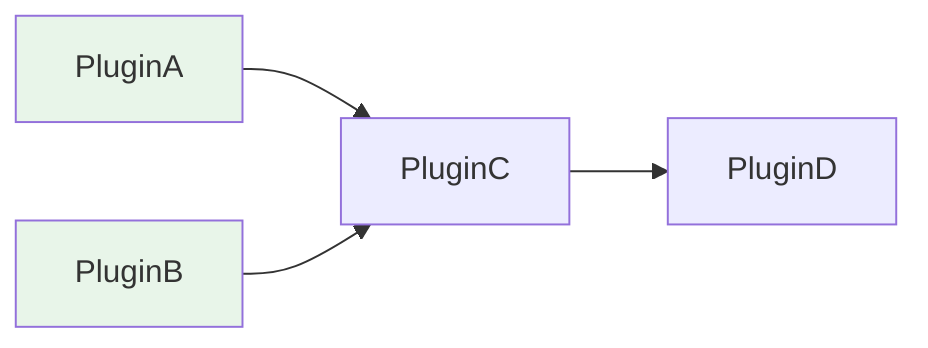

# 插件加载与权限树

> 插件拓扑排序依赖解析、RBAC Trie 前缀树实现。

---

## 1. 插件加载拓扑排序

> 源码：`ncatbot/plugin/loader/resolver.py`

`DependencyResolver` 基于 Kahn 算法实现拓扑排序，确保插件按依赖顺序加载。

### 1.1 依赖图构建

依赖来自 `manifest.toml` 的 `dependencies` 字段：

```toml
# 插件 manifest.toml
[dependencies]
base_plugin = ">=1.0.0"
```

解析为 `PluginManifest.dependencies: Dict[str, str]`（名称 → 版本约束）。

`resolve()` 首先构建邻接图：

```python
# resolver.py — resolve()
graph: Dict[str, Set[str]] = {}
for name, manifest in manifests.items():
    deps = set(manifest.dependencies.keys())
    graph[name] = deps
```

然后检测缺失依赖——任何依赖名若不在 `manifests` 中，立即报错：

```python
all_names = set(graph.keys())
for name, deps in graph.items():
    for dep in deps:
        if dep not in all_names:
            raise PluginMissingDependencyError(name, dep)
```

### 1.2 Kahn 算法拓扑排序

```python
# resolver.py — Kahn 拓扑排序核心
in_degree = {k: 0 for k in graph}
adj: Dict[str, List[str]] = defaultdict(list)
for cur, deps in graph.items():
    for d in deps:
        adj[d].append(cur)     # d → cur（d 被 cur 依赖）
        in_degree[cur] += 1

q = deque(k for k, v in in_degree.items() if v == 0)
order: List[str] = []
while q:
    cur = q.popleft()
    order.append(cur)
    for nxt in adj[cur]:
        in_degree[nxt] -= 1
        if in_degree[nxt] == 0:
            q.append(nxt)
```



上图中，加载顺序为：`A → B → C → D`（A、B 入度为 0，先加载）。

**边的方向**：`adj[d].append(cur)` 表示"d 加载后才能加载 cur"，即 `d → cur` 的方向。

### 1.3 循环依赖检测

Kahn 算法的天然特性——如果排序结果数量不等于图中节点数量，则存在循环：

```python
if len(order) != len(graph):
    raise PluginCircularDependencyError(set(graph) - set(order))
```

`set(graph) - set(order)` 正好是参与循环的节点集合。

**子集解析**：`resolve_subset()` 用于仅加载指定插件及其传递依赖：

```python
# resolver.py — resolve_subset() 核心
def _collect(name: str) -> None:
    if name in needed:
        return
    manifest = manifests.get(name)
    if manifest is None:
        raise PluginMissingDependencyError(name, name)
    needed.add(name)
    for dep in manifest.dependencies:
        _collect(dep)
```

递归收集后，对子集调用 `resolve()` 进行拓扑排序。

**版本约束验证**：`validate_versions()` 使用 `packaging` 库检查实际版本是否满足 `SpecifierSet`：

```python
# resolver.py — validate_versions()
from packaging.specifiers import SpecifierSet
from packaging.version import parse as parse_version

for name, manifest in manifests.items():
    for dep_name, constraint in manifest.dependencies.items():
        dep = manifests.get(dep_name)
        if not SpecifierSet(constraint).contains(parse_version(dep.version)):
            raise PluginVersionError(name, dep_name, constraint, dep.version)
```

**异常类型汇总**：

| 异常 | 场景 |
|------|------|
| `PluginMissingDependencyError` | 依赖的插件未找到 |
| `PluginCircularDependencyError` | 检测到循环依赖 |
| `PluginVersionError` | 版本约束不满足 |

---

## 2. RBAC Trie 实现

> 源码：`ncatbot/service/builtin/rbac/trie.py`、`ncatbot/service/builtin/rbac/path.py`

`PermissionTrie` 使用嵌套字典实现前缀树，用于高效存储和检索权限路径。

### 2.1 节点结构

Trie 采用纯字典嵌套，每个键为路径段，值为子树字典：

```python
class PermissionTrie:
    def __init__(self, case_sensitive: bool = True):
        self.root: Dict = {}
        self.case_sensitive = case_sensitive
```

**示例**：添加 `plugin.admin.kick` 和 `plugin.admin.ban` 后的树结构：

```
root
└── "plugin"
    └── "admin"
        ├── "kick": {}    ← 叶子节点（空字典）
        └── "ban": {}
```

**PermissionPath** 辅助类将路径字符串按 `.` 分隔：

```python
class PermissionPath:
    SEPARATOR = "."

    def __init__(self, path):
        self.raw = path
        self.parts = tuple(path.split(self.SEPARATOR))
```

### 2.2 插入 / 查找 / 删除

**插入**（`add`）——沿路径逐段创建节点：

```python
# trie.py — add()
def add(self, path: str) -> None:
    ppath = self._normalize(path)
    if "*" in ppath.raw or "**" in ppath.raw:
        raise ValueError("添加的路径不能包含通配符 * 或 **")
    node = self.root
    for part in ppath:
        if part not in node:
            node[part] = {}
        node = node[part]
```

> 注意：存储路径禁止使用通配符，通配符仅用于查询。

**删除**（`remove`）——自底向上回收空节点：

```python
# trie.py — remove()
def remove(self, path: str) -> None:
    ppath = self._normalize(path)
    nodes = [(None, None, self.root)]
    node = self.root
    for part in ppath:
        if part not in node:
            return
        nodes.append((node, part, node[part]))
        node = node[part]
    # 自底向上删除空节点
    for i in range(len(nodes) - 1, 0, -1):
        parent, key, current = nodes[i]
        if not current:
            del parent[key]
        else:
            break
```

自底向上遍历时，只要当前节点为空字典就从父节点中删除该键，遇到非空子树则停止。

### 2.3 通配符匹配算法

`exists()` 方法支持两种通配符，通过递归 `_check()` 实现：

```python
# trie.py — _check()
def _check(self, node: dict, parts: tuple, index: int, exact: bool) -> bool:
    if index >= len(parts):
        return not exact or not node  # exact 模式要求叶子节点

    part = parts[index]

    if part == "**":
        return True                   # 匹配任意深度，直接返回
    elif part == "*":
        return any(                   # 匹配当前层任一子节点
            self._check(node[child], parts, index + 1, exact)
            for child in node
        )
    elif part in node:
        return self._check(node[part], parts, index + 1, exact)

    return False
```

**通配符语义**：

| 通配符 | 含义 | 示例 |
|--------|------|------|
| `*` | 匹配当层任意**一个**节点 | `plugin.*.kick` 匹配 `plugin.admin.kick`、`plugin.mod.kick` |
| `**` | 匹配当前及之后**任意深度** | `plugin.**` 匹配 `plugin` 下所有路径 |

**exact 参数**：当 `exact=True` 时，要求路径必须到达叶子节点（空字典），中间节点不算匹配。

**序列化**：`to_dict()` / `from_dict()` 直接导出/恢复嵌套字典，`get_all_paths()` 递归收集所有叶子路径。

---

*本文档基于 NcatBot 5.0.0rc7 源码编写。如源码有更新，请以实际代码为准。*
