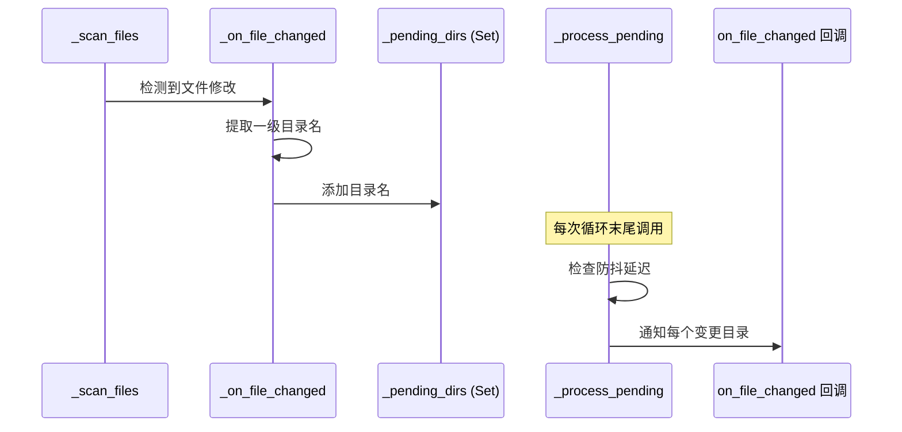
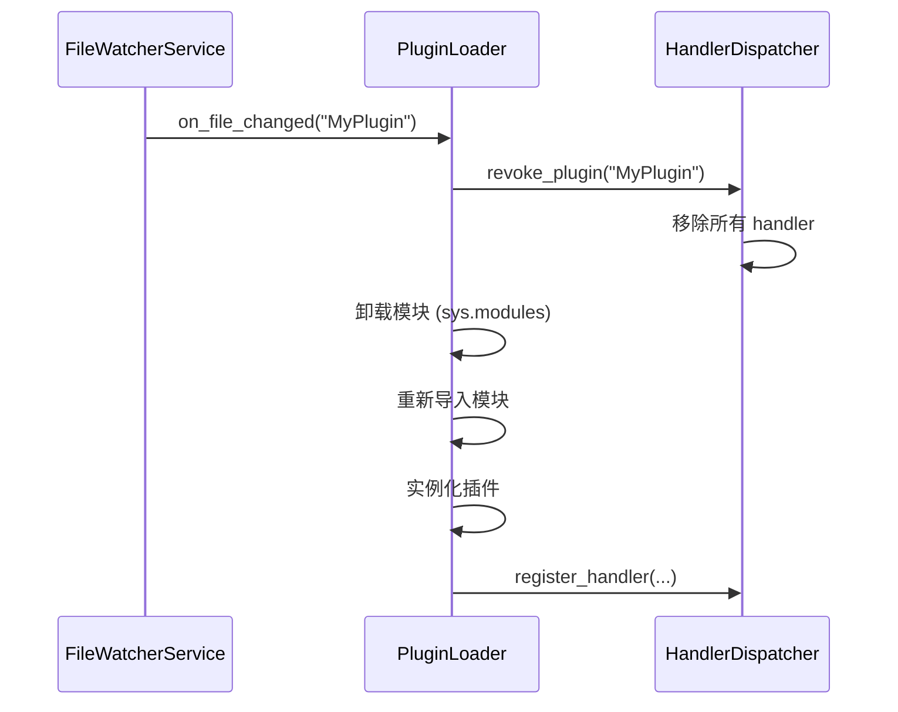
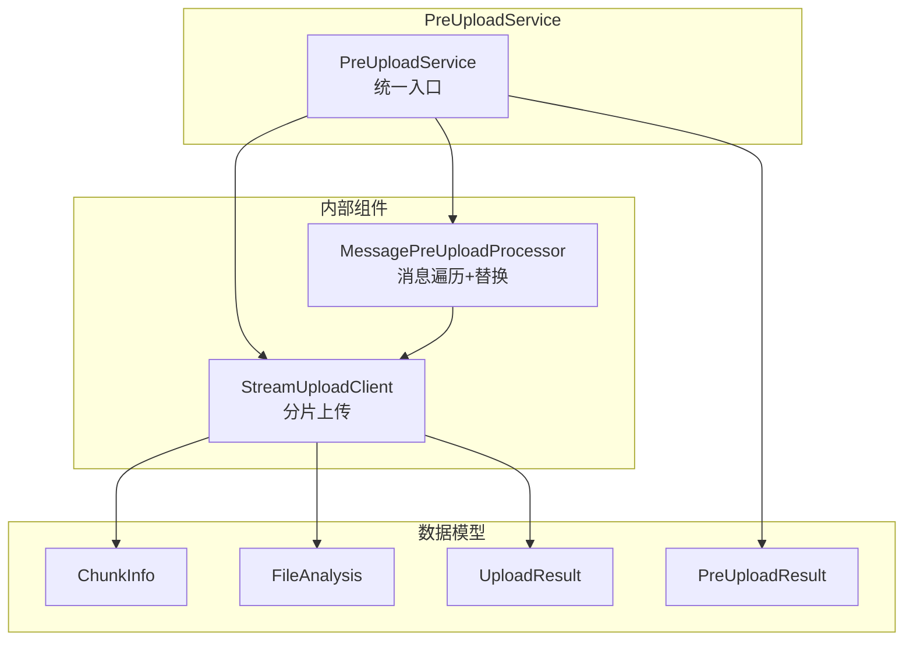
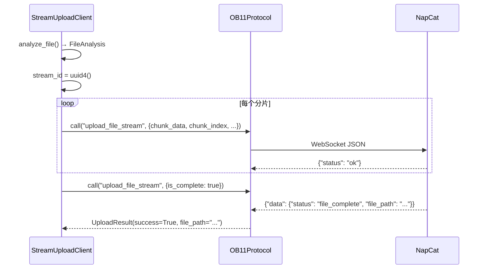

# 热重载与预上传服务

> FileWatcher 文件监控热重载、PreUpload 分片上传服务的内部实现。

---

## 3. 热重载 FileWatcher 实现

> 源码：`ncatbot/service/builtin/file_watcher/service.py`

`FileWatcherService` 基于轮询扫描实现文件变化检测，当插件源码变更时通知 `PluginLoader` 执行热重载。

### 3.1 文件系统监控机制

FileWatcher **不使用** inotify / ReadDirectoryChanges 等 OS 级文件监控 API，而是通过后台线程定时轮询 `os.path.getmtime()` 检测变化：

```python
# service.py — _watch_loop()
def _watch_loop(self) -> None:
    while not self._stop_event.is_set():
        for watch_dir in list(self._watch_dirs):
            if os.path.exists(watch_dir):
                self._scan_files(watch_dir)
        self._check_config_file()
        self._process_pending()
        self._stop_event.wait(self._watch_interval)
```

| 参数 | 默认值 | 测试模式 | 说明 |
|------|--------|----------|------|
| `_watch_interval` | 1.0s | 0.02s | 扫描间隔 |
| `_debounce_delay` | 1.0s | 0.02s | 防抖延迟 |

**扫描实现**：使用 `Path.rglob("*.py")` 递归查找所有 Python 文件，跳过 `site-packages`。对每个文件通过 `os.path.getmtime()` 比较修改时间，新文件或修改时间变化时调用 `_on_file_changed()`。同时检测已删除文件（缓存中存在但磁盘上不存在）并触发通知。

**首次扫描保护**：`_first_scan_done` 标志确保第一次扫描只建立缓存，不触发变更通知。

### 3.2 变更检测 → 通知流程

变更事件经过 **防抖** 和 **目录聚合** 两步处理：



**目录聚合**：`_on_file_changed()` 将文件路径转化为一级插件目录名（如 `plugins/MyPlugin/utils/helper.py` → `MyPlugin`），同一插件的多个文件变更合并为一次通知：

```python
rel_path = os.path.relpath(file_path, plugins_dir)
parts = rel_path.split(os.sep)
if len(parts) > 1:
    first_level_dir = parts[0]
    with self._pending_lock:
        self._pending_dirs.add(first_level_dir)
```

**防抖**：`_process_pending()` 检查距上次处理是否超过 `_debounce_delay`，未到时间则跳过。`pause()` / `resume()` 通过 `threading.Event` 控制是否处理待变更队列。FileWatcher 同时监听全局 `config.yaml`，通过独立的 `on_config_changed` 回调通知配置变更。

### 3.3 模块卸载 → 重新导入流程

当 `on_file_changed` 回调触发时（通常由 `PluginLoader` 注册），执行以下流程：



`HandlerDispatcher.revoke_plugin()` 精确清理该插件的所有 handler：

```python
# registry/dispatcher.py — revoke_plugin()
def revoke_plugin(self, plugin_name: str) -> int:
    removed = 0
    for event_type in list(self._handlers.keys()):
        original_len = len(self._handlers[event_type])
        self._handlers[event_type] = [
            e for e in self._handlers[event_type]
            if e.plugin_name != plugin_name
        ]
        removed += original_len - len(self._handlers[event_type])
        if not self._handlers[event_type]:
            del self._handlers[event_type]
    return removed
```

> **注意**：热重载仅在 `debug_mode` 开启时生效。

---

## 4. 预上传服务（PreUpload）

> 源码：`ncatbot/adapter/napcat/service/preupload/`

预上传服务负责将消息中的本地文件 / Base64 数据在发送前上传到 NapCat 服务端，返回服务端文件路径后再替换消息内容。

### 4.1 组件架构



| 组件 | 文件 | 职责 |
|------|------|------|
| `PreUploadService` | `__init__.py` | 统一入口，提供 `preupload_file()` / `process_message()` 等高层接口 |
| `StreamUploadClient` | `client.py` | 文件分片、SHA256 计算、分片逐个上传 |
| `MessagePreUploadProcessor` | `processor.py` | 递归遍历消息结构，识别需上传的文件段并替换 |
| `models.py` | `models.py` | 数据类定义（`ChunkInfo`、`FileAnalysis`、`UploadResult` 等） |

### 4.2 分片上传流程

`StreamUploadClient` 将文件切分为固定大小的分片（默认 500KB），逐片上传：

```python
# client.py — 常量
DEFAULT_CHUNK_SIZE = 500 * 1024       # 500KB
DEFAULT_FILE_RETENTION = 600 * 1000   # 600 秒
```

**文件分析**：`analyze_file()` 一次性读取文件并计算 SHA256、切片、Base64 编码：

```python
# client.py — analyze_file() 核心
chunks: List[ChunkInfo] = []
hasher = hashlib.sha256()
with open(path, "rb") as f:
    while True:
        chunk = f.read(self._chunk_size)
        if not chunk:
            break
        hasher.update(chunk)
        total_size += len(chunk)
        base64_data = base64.b64encode(chunk).decode("utf-8")
        chunks.append(ChunkInfo(data=chunk, index=chunk_index, base64_data=base64_data))
        chunk_index += 1

return FileAnalysis(
    chunks=chunks, sha256_hash=hasher.hexdigest(),
    total_size=total_size, filename=path.name,
)
```

**上传过程**：



每个分片请求的参数：

| 字段 | 说明 |
|------|------|
| `stream_id` | 上传会话 UUID |
| `chunk_data` | Base64 编码的分片数据 |
| `chunk_index` | 分片索引（0 起始） |
| `total_chunks` | 总分片数 |
| `file_size` | 文件总大小 |
| `expected_sha256` | 文件 SHA256 哈希 |
| `filename` | 文件名 |
| `file_retention` | 保留时间（毫秒） |

### 4.3 消息预处理器

`MessagePreUploadProcessor` 递归遍历消息字典结构，识别 `image`、`video`、`record`、`file` 类型的消息段：

```python
DOWNLOADABLE_TYPES = frozenset({"image", "video", "record", "file"})
```

**文件来源判断**：

```python
def needs_upload(file_value: str) -> bool:
    return is_local_file(file_value) or is_base64_data(file_value)
```

| 来源类型 | 判断条件 | 处理方式 |
|----------|----------|----------|
| 本地文件 | `file://` 前缀或绝对路径 | `upload_file()` 上传 |
| Base64 数据 | `base64://` 前缀 | 解码后 `upload_bytes()` 上传 |
| 远程 URL | `http://` / `https://` | 不处理，直接保留 |

**递归遍历**：处理嵌套的转发消息（`forward` / `node` 类型），确保深层消息段中的文件也被上传：

```python
# processor.py — _process_dict() 摘要
if msg_type == "forward":
    content = node.get("data", {}).get("content")
    if content:
        uploaded_count += await self._process_node(content, errors)

if msg_type == "node":
    data = node.get("data", {})
    for key in ("content", "message"):
        value = data.get(key)
        if value:
            uploaded_count += await self._process_node(value, errors)
```

处理完成后，`data["file"]` 被替换为服务端返回的文件路径，上层 API 发送时使用新路径。

---

*本文档基于 NcatBot 5.0.0rc7 源码编写。如源码有更新，请以实际代码为准。*
