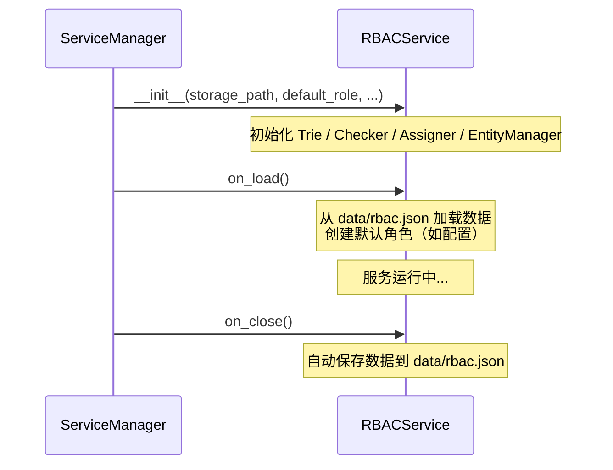

# RBACService API 与高级用法

> RBACService 完整 API、层级权限设计与默认权限策略。

---

## 3. RBACService 完整 API

### 3.1 服务生命周期

`RBACService` 继承自 `BaseService`，作为内置服务由 `ServiceManager` 管理。

**构造参数：**

```python
class RBACService(BaseService):
    name = "rbac"
    description = "基于角色的访问控制服务"
    DEFAULT_STORAGE_PATH = "data/rbac.json"

    def __init__(
        self,
        storage_path: Optional[str] = DEFAULT_STORAGE_PATH,
        default_role: Optional[str] = None,
        case_sensitive: bool = True,
        **config,
    )
```

**生命周期：**



### 3.2 完整接口表

**权限路径管理：**

| 方法 | 签名 |
|---|---|
| `add_permission` | `(path: str) -> None` |
| `remove_permission` | `(path: str) -> None` |
| `permission_exists` | `(path: str) -> bool` |

**角色管理：**

| 方法 | 签名 |
|---|---|
| `add_role` | `(role: str, exist_ok: bool = False) -> None` |
| `remove_role` | `(role: str) -> None` |
| `role_exists` | `(role: str) -> bool` |
| `set_role_inheritance` | `(role: str, parent: str) -> None` |

**用户管理：**

| 方法 | 签名 |
|---|---|
| `add_user` | `(user: str, exist_ok: bool = False) -> None` |
| `remove_user` | `(user: str) -> None` |
| `user_exists` | `(user: str) -> bool` |
| `user_has_role` | `(user: str, role: str, create_user: bool = True) -> bool` |
| `assign_role` | `(target_type: Literal["user"], user: str, role: str, create_user: bool = True) -> None` |
| `unassign_role` | `(target_type: Literal["user"], user: str, role: str) -> None` |

**权限分配：**

| 方法 | 签名 |
|---|---|
| `grant` | `(target_type: Literal["user", "role"], target: str, permission: str, mode: Literal["white", "black"] = "white", create_permission: bool = True) -> None` |
| `revoke` | `(target_type: Literal["user", "role"], target: str, permission: str) -> None` |

**权限检查：**

| 方法 | 签名 |
|---|---|
| `check` | `(user: str, permission: str, create_user: bool = True) -> bool` |

**持久化：**

| 方法 | 签名 |
|---|---|
| `save` | `(path: Optional[Path] = None) -> None` |

### 3.3 emit_event 与权限变更通知

`RBACService` 继承自 `BaseService`，拥有 `emit_event` 回调属性（类型为 `Optional[EventCallback]`）。该回调由 `ServiceManager` 在服务加载时注入，可用于向事件系统发布权限变更事件。

```python
class BaseService(ABC):
    emit_event: Optional[EventCallback] = None  # 由 ServiceManager 注入
```

如果需要在权限变更时通知其他组件，可在 `RBACService` 的子类中调用 `self.emit_event` 发布自定义事件。

---

## 4. 高级用法

### 4.1 层级权限设计

利用角色继承实现层级权限体系：

```python
async def on_load(self):
    # 注册分层权限
    self.add_permission("shop.browse")      # 浏览商品
    self.add_permission("shop.buy")          # 购买商品
    self.add_permission("shop.manage")       # 管理商品
    self.add_permission("shop.admin")        # 店铺管理

    # 创建分层角色
    self.add_role("shop_guest")       # 游客
    self.add_role("shop_member")      # 会员
    self.add_role("shop_manager")     # 店长
    self.add_role("shop_admin")       # 管理员

    if self.rbac:
        # 逐层分配权限
        self.rbac.grant("role", "shop_guest", "shop.browse")
        self.rbac.grant("role", "shop_member", "shop.buy")
        self.rbac.grant("role", "shop_manager", "shop.manage")
        self.rbac.grant("role", "shop_admin", "shop.admin")

        # 设置继承链: admin > manager > member > guest
        self.rbac.set_role_inheritance("shop_member", "shop_guest")
        self.rbac.set_role_inheritance("shop_manager", "shop_member")
        self.rbac.set_role_inheritance("shop_admin", "shop_manager")
```

这样，`shop_admin` 角色的用户将自动拥有所有四项权限。

### 4.2 默认权限策略

**策略一：默认角色**

通过 `RBACService` 的 `default_role` 参数，让新用户自动获得基础权限：

```python
rbac_service = RBACService(
    default_role="default_user",
)
```

新用户首次被 `check` 或 `add_user` 时，将自动获得 `default_user` 角色及其对应权限。

**策略二：白名单模式（推荐）**

默认拒绝所有权限，仅通过授权开放：

```python
# 默认行为：check 返回 False
# 需要显式授权
if self.rbac:
    self.rbac.assign_role("user", user_id, "my_plugin_user")
```

**策略三：黑名单排除**

对需要限制特定用户的场景，使用黑名单拒绝：

```python
if self.rbac:
    # 将权限加入用户黑名单，即使角色允许也会被拒绝
    self.rbac.grant("user", bad_user_id, "my_plugin.feature", mode="black")
```

> **记住**：黑名单优先级高于白名单。即使用户通过角色获得了某个权限，如果该权限出现在用户或其任意角色的黑名单中，检查结果仍为 `False`。

---

> **上一篇**：[RBAC 核心模块与插件集成](2a_integration.md) · **返回**：[RBAC 权限管理](README.md) · [RBAC 模型详解](1_model.md)
