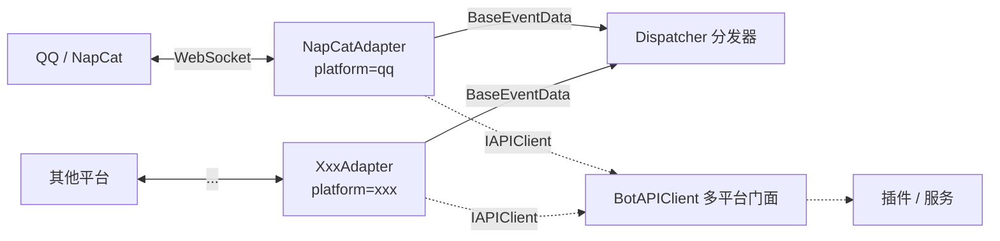

# 适配器参考

> 适配器层完整参考 — 多平台适配、WebSocket 连接、事件解析、API 调用

---

## Quick Reference

```python
from ncatbot.adapter import BaseAdapter, NapCatAdapter, MockAdapter
```

适配层（Adapter）负责屏蔽底层通信协议差异，为上层提供统一的事件流和 Bot API 接口。

| 适配器 | `platform` | 协议 | 用途 |
|---|---|---|---|
| `NapCatAdapter` | `"qq"` | OneBot v11 (NapCat) | 生产环境，连接真实 QQ 服务 |
| `MockAdapter` | `"mock"` | mock | 测试环境，内存模拟，无需网络 |



### BaseAdapter 抽象接口

| 属性/方法 | 签名 | 说明 |
|-----------|------|------|
| `name` | `str` | 适配器名称 |
| `platform` | `str` | 平台标识（`"qq"` / `"mock"` 等） |
| `supported_protocols` | `List[str]` | 支持的协议列表 |
| `setup` | `async () → None` | *abstract* — 准备平台环境 |
| `connect` | `async () → None` | *abstract* — 建立连接并初始化 API |
| `disconnect` | `async () → None` | *abstract* — 断开连接，释放资源 |
| `listen` | `async () → None` | *abstract* — 阻塞监听消息 |
| `get_api` | `() → IAPIClient` | *abstract* — 返回 API 客户端 |
| `connected` | `@property → bool` | *abstract* — 连接状态 |
| `set_event_callback` | `(callback) → None` | 设置事件数据回调 |

### AdapterRegistry 方法

| 方法 | 签名 | 说明 |
|------|------|------|
| `register` | `(name, cls) → None` | 注册适配器类 |
| `discover` | `() → Dict[str, Type[BaseAdapter]]` | 发现内置 + entry_point 适配器 |
| `list_available` | `() → list[str]` | 列出可用适配器名 |
| `create` | `(entry, *, bot_uin="", websocket_timeout=15) → BaseAdapter` | 工厂创建适配器实例 |

### MockAdapter 方法（测试用）

| 方法 | 签名 | 说明 |
|------|------|------|
| `inject_event` | `async (data: BaseEventData) → None` | 注入测试事件 |
| `stop` | `() → None` | 停止 listen 循环 |
| `mock_api` | `@property → MockBotAPI` | 获取 Mock API 实例 |

### MockBotAPI 断言方法

| 方法 | 签名 | 说明 |
|------|------|------|
| `called` | `(action) → bool` | 检查 action 是否被调用 |
| `call_count` | `(action) → int` | 调用次数 |
| `get_calls` | `(action) → List[APICall]` | 获取指定调用记录 |
| `last_call` | `(action=None) → Optional[APICall]` | 最后一次调用 |
| `set_response` | `(action, response) → None` | 预设返回值 |
| `reset` | `() → None` | 清除所有记录 |

**源码位置**: `ncatbot/adapter/` · 详见 [多平台开发指南](../../guide/multi_platform/)

---

## 适配器组件速查

---

## 本目录索引

| 文件 | 说明 |
|------|------|
| [1_connection.md](1_connection.md) | WebSocket 连接管理 — NapCatWebSocket、重连策略、NapCatLauncher 进程管理 |
| [2_protocol.md](2_protocol.md) | 协议处理 — OB11Protocol 请求-响应匹配、事件解析、NapCatBotAPI 实现 |
